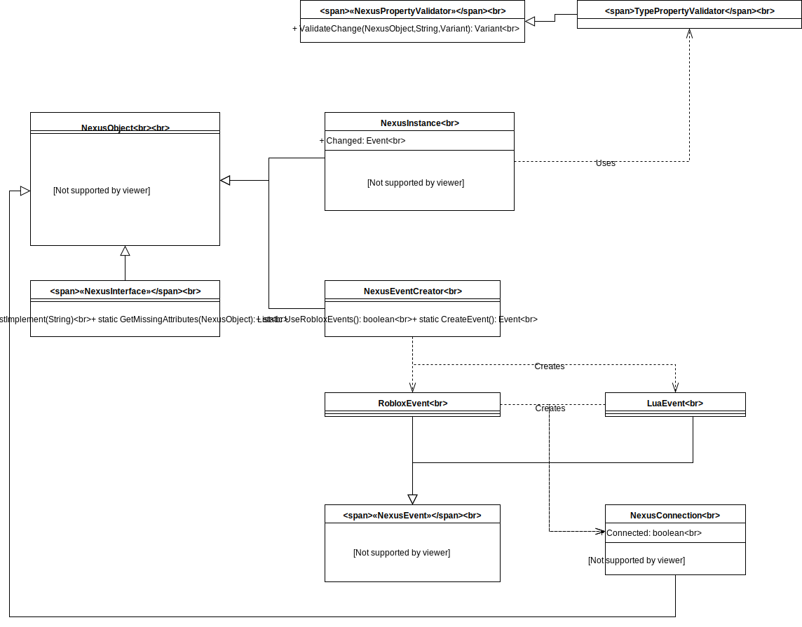

# Nexus Instance
Nexus Instance is a framework meant to simplify the
creation of classes in Lua, both in terms of syntax and
being able to have the context of "super". The framework
includes a base `NexusObject` class, as well as a more
powerful `NexusInstance` class to allow for locking
of properties and a `Changed` event.

## Class Diagram Overview
Below is an overview of the classes in Nexus Instance.
[Why Nexus Instance](why-nexus-instance.md) covers most
of the classes used.
